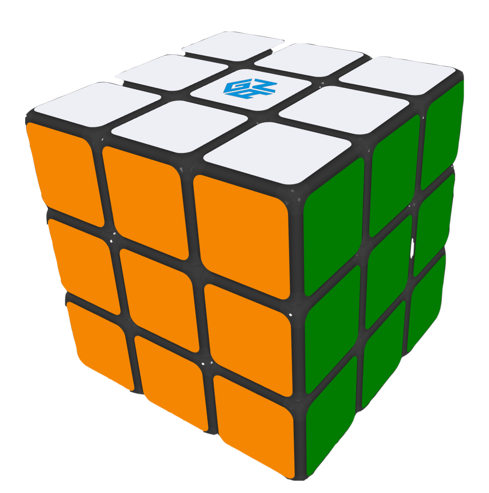

# hypercube
Animated 3D Rubik's Cube library made with Three.js.

## Demos
* [Desktop demo](https://dmitrydobryakov.com/hypercube/demo-web)
* [Desktop demo timer](https://dmitrydobryakov.com/hypercube/demo-web-timer)
* [Mobile demo](https://dmitrydobryakov.com/hypercube/demo-mobile)

## Keyboard controls

| Key | Move |
| --- | ---- |
| j   | U    |
| f   | U'   |
| i   | R    |   
| k   | R'   |   
| e   | L'   |   
| d   | L    |   
| h   | F    |   
| g   | F'   |   
| s   | D    |   
| l   | D'   |   
| w   | B    |   
| o   | B'   |   
| ;   | y    |
| a   | y'   |
| n   | x'   |
| b   | x'   |
| y   | x    |
| t   | x    |
| q   | z'   |
| p   | z    |
| x   | M'   |
| ,   | M    |
| u   | r    |
| m   | r'   |
| r   | l'   |
| v   | l    |

## Mobile controls

Swiping on a 3x3 grid. Cells are numbered 1 to 9, left to right, top to bottom.

| Swipe | Move |
| ----- | ---- |
| 32    | U    |	
| 21    | U    |
| 12    | U'   |	
| 23    | U'   |
| 31    | U2   |	
| 13    | U2'  |
| 63    | R    |
| 36    | R'   |
| 93    | R2   | 	
| 39    | R2'  |
| 69    | F    |	
| 74    | F    |
| 47    | F'   |
| 96    | F'   |
| 67    | F2   | 	
| 76    | F2'  |
| 54    | y    |	
| 65    | y    |
| 56    | y'   |	
| 45    | y'   |
| 64    | y2   | 	
| 46    | y2'  |
| 52    | x    |	
| 85    | x    |
| 25    | x'   | 	
| 58    | x'   |
| 82    | x2   | 	
| 28    | x2'  |
| 78    | D    |	
| 89    | D    |
| 87    | D'   | 	
| 98    | D'   |
| 79    | D2   | 	
| 97    | D2'  |
| 14    | L    |
| 41    | L'   |
| 17    | L2   | 	
| 71    | L2'  |
| 24    | B    |	
| 62    | B    |
| 26    | B'   |	
| 42    | B'   |
| 29    | B2   | 	
| 72    | B2   |
| 92    | B2'  |	
| 27    | B2'  |
| 73    | z    |	
| 19    | z    |
| 37    | z'   |	
| 91    | z'   |
| 86    | M'   |	
| 84    | M'   |
| 68    | M    |	
| 48    | M    |
| 38    | M2   |	
| 18    | M2   |
| 83    | M2'  |	
| 81    | M2'  |
| 94    | f'   |
| 49    | f    |
| 16    | S    |
| 61    | S'   |
| 43    | E    |
| 34    | E'   |
| 95    | r    |
| 59    | r'   |
| 57    | l    |
| 75    | l'   |
| 15    | u'   | 	
| 53    | u'   |
| 35    | u    | 	
| 51    | u    |
